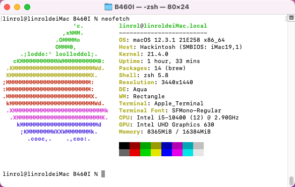

##  i5 10400 + ASUS ROG STRIX B460-I GAMING 核显 Hackintosh EFI

- OpenCore引导macOS 12.3.1 (支持向下兼容到Catalina，目前最低支持10.15.7) && win10

---

### 电脑配置

| 规格     | 详细信息                                     |
| -------- | ---------------------------------------- |
| 主板型号 | Asus ROG Strix B460-I             |
| 处理器   | Intel Core i5 10400           |
| 内存     | 海盗船RGB 16GB 2x8GB DDR4 3000Mhz                 |
| 电源     | 全汉MS450                    |
| 机箱     | 酷鱼T40                    |
| 显卡     | HD630                    |
| 硬盘     | 爱国者p2000 500GB M.2 NVMe                  |
| 声卡     | Realtek ALCS1220A (Layout 7)                    |
| 网卡&蓝牙     | BCM94352Z（fenvi）                             |
| 板载网卡 | Intel® i219-V 1Gb Ethernet |
| 显示器   | 小米曲面显示器  |

---

### BIOS设置

**关闭：**
- Fast Boot
- VT-d
- CSM
- Intel SGX

**开启：**
- VT-x
- Above 4G decoding
- Hyper-Threading
- Execute Disable Bit
- EHCI/XHCI Hand-off
- OS type: other system
- DVMT Pre-Allocated (iGPU Memory): 64MB

---

### 完美程度
- 核显加速，显存2048MB
- 睡眠正常（睡眠一晚上依旧可唤醒，笔者没遇到过 _BUG_，用阿斯加特内存睡眠久了会沙雕，会出现频繁死机 _BUG_ ，重装跟换系统无解，最终是发现内存过热导致黑苹果检测关机）
- _CPU_ 睿频正常，单核4.3，全核4.0
- 传感器正常工作、_CPU_ 温度、_SSD_ 温度风扇转速均可获取（通过iStat Menus查看）
- 定制USB映射正常（_USB2.0_  _TYPE-C_ 音频口不可识别（可以识别U盘），其他音频口正常，不过有3.5耳机和显示器扬声器，无所谓；
  USB3.2Gen2x2未测试，没有这么高的设备，不过是系统识别出单独走线，符合官方描述，应该可达到20Gbps）
- 有线网正常工作
- 驱动 _DW1560 WIFI_ ，蓝牙正常

---

### 使用的工具
- [HackintoshBuild](https://github.com/bugprogrammer/HackintoshBuild)
- [ProperTree](https://github.com/corpnewt/ProperTree)
- [Hackintool](https://github.com/headkaze/Hackintool)

---

### FAQ
- 记得修改platforminfo里面的串号，以免不能登陆app store
- 显示器输出支持HDMI DP 核显独显都支持
- 若有bug并且可以修复，记得提PR
- 替换EFI后在终端记得执行:`sudo kextcache -i/`
---
